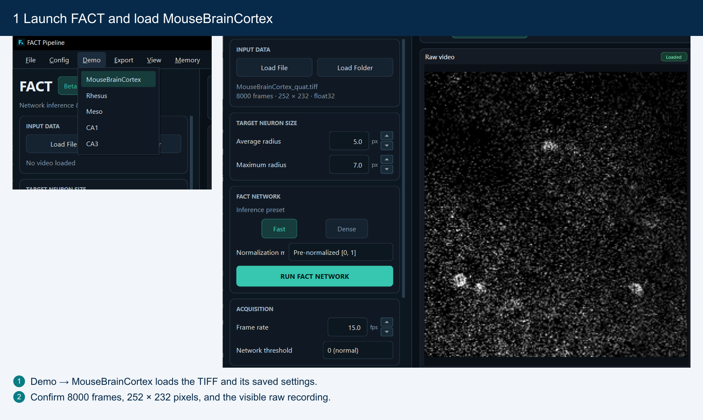
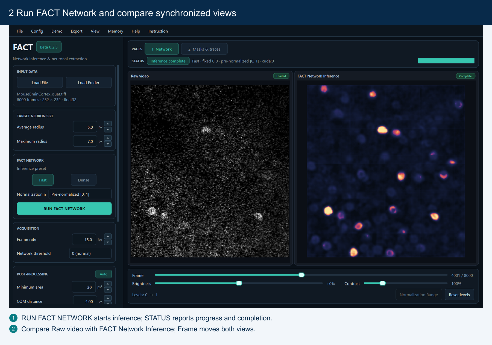
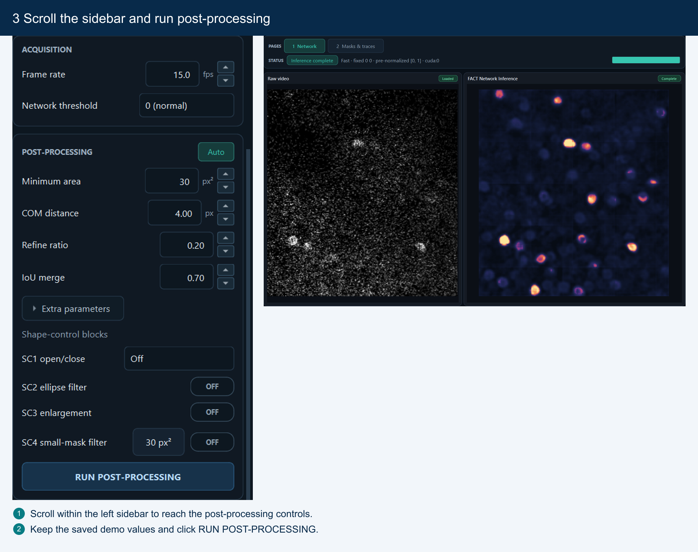
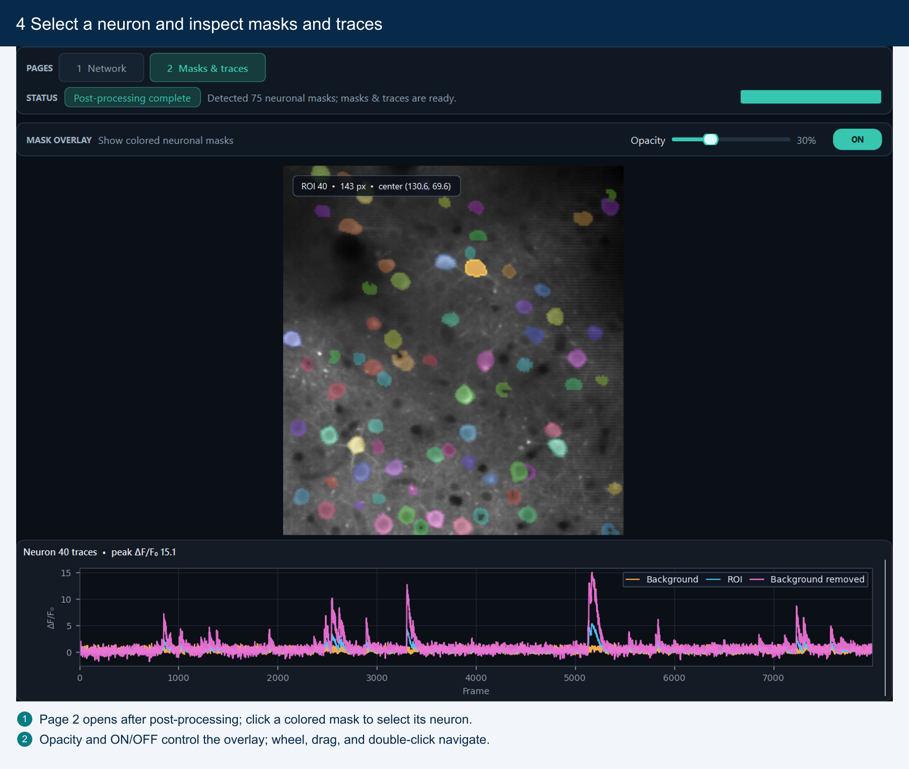
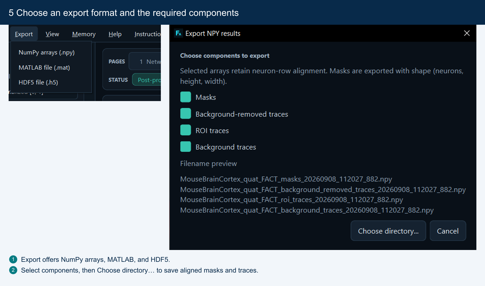
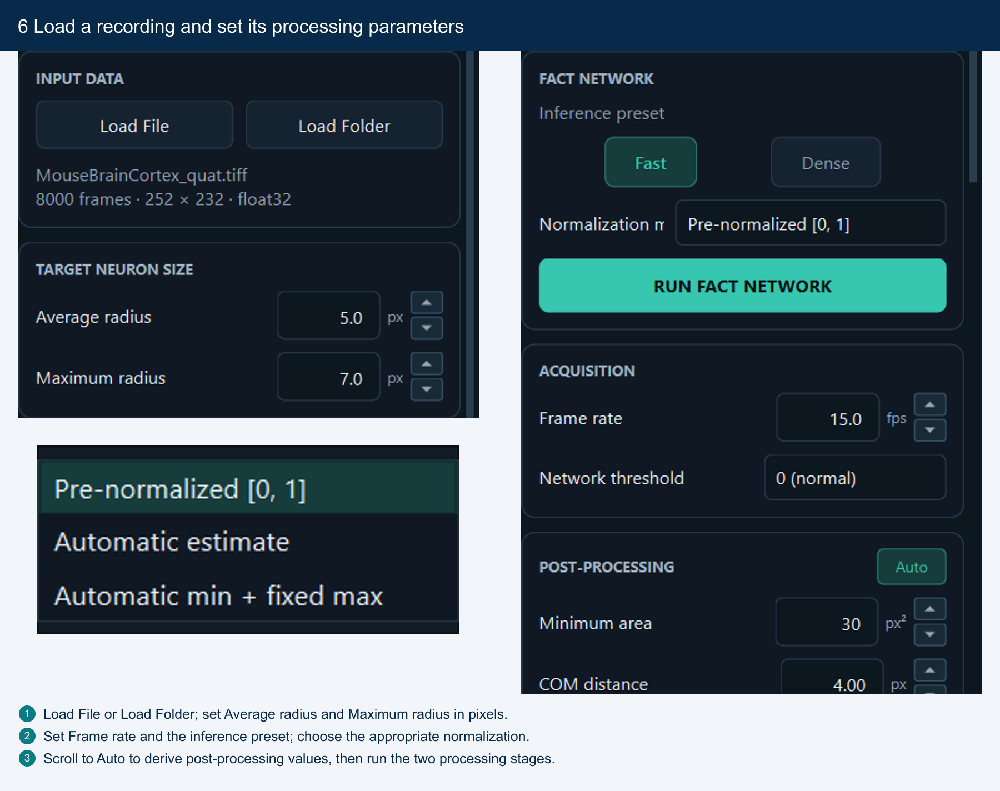

# FACT: Foundation Model for Calcium-Like Transient Extraction and Neuronal Footprint Segmentation


[](https://creativecommons.org/licenses/by-nc/4.0/)

FACT (Find Any Calcium-like Transients) is a foundation model for extracting calcium-like transients and segmenting neuronal footprints in functional imaging videos. This repository contains the model implementation, inference and post-processing pipelines, desktop GUI download instructions, demonstration notebooks, and reproducibility notebooks.

## System requirements

FACT is supported on 64-bit Microsoft Windows 10 and Windows 11, and on 64-bit Linux (x86-64). macOS is not supported.

The software has been tested on Windows 10, the current Windows 11 release, Ubuntu 18.04, and Ubuntu 20.04.

### Software dependencies

The core dependencies and the versions used in this release are:

- Python 3.11
- PyTorch 2.5.1
- CUDA 12.4
- MONAI 1.5.2

The complete pinned environments are specified in `Installation/environment_fact_py311.yml` (Windows) and `Installation/environment_fact_py311_linux.yml` (Linux). GPU execution requires a host NVIDIA driver compatible with the CUDA 12.4 runtime.

### Hardware

An NVIDIA GPU is recommended. The minimum recommended GPU memory is 4 GB. CPU execution is supported when CUDA is unavailable, but inference is substantially slower. 32 GB of system RAM is recommended.

An NVIDIA GPU constitutes non-standard hardware relative to a CPU-only desktop computer. It is recommended for practical use of this software but is not strictly required.

## Installation

### GUI-only: standalone GUI option (Windows 10/11)

FACT is also distributed as a stand-alone packaged GUI for 64-bit Windows 10
and Windows 11. To run the supplied GUI demos or use FACT through the desktop
application, you may download the GUI and Demo data without cloning this code
repository or installing the notebook environment. Download them from the
[GUI and Demo Google Drive share](https://drive.google.com/drive/folders/100HG79hDwNtgq8Pa977RwJA-zxx7tfj4?usp=sharing).

Download the `GUI` folder together with the desired Demo data, keep the GUI
executable beside its runtime directory, and preserve the `data\Demo\` layout
described below. Clone the repository only when you need the notebooks,
reproduction workflows, or source code.

```text
FACT-GUI-and-Demo/
├── GUI/
└── data/
    └── Demo/
        ├── GUI-Config/
        ├── Meso/
        ├── Mouse hippocampus/
        ├── MouseBrainCortex/
        └── Rhesus/
```

### Full Code Repository: Clone the repository

```bash
git clone <REPOSITORY_URL>
cd FACT-Code-Release
```

Replace `<REPOSITORY_URL>` with the public URL of this repository after it is published.

### Windows 64-bit: online installation

The recommended Windows environment is `fact_py311`, based on Python 3.11. The installer uses a private Miniconda runtime and does not depend on a pre-existing Conda installation.

From Command Prompt, run:

```bat
Install_FACT_on_Win64.bat
```

The explicit online entry point is also available:

```bat
Install_FACT_Online_on_Win64.bat
```

The Git repository does not contain the offline environment archive, so the common installer automatically selects online mode after a normal clone. The installer:

- installs the private Conda runtime under `%LOCALAPPDATA%\FACT\Miniconda3-24.5.0`;
- installs the environment under `%USERPROFILE%\.conda\envs\fact_py311`;
- verifies package records, Conda metadata, critical binaries, runtime imports, and the expected `pip check` result;
- registers the environment with Conda and installs the `Python (fact_py311)` Jupyter kernel; and
- writes installation logs under `%LOCALAPPDATA%\FACT\logs`.

The installer only creates the Conda/Python environment. It does not copy FACT source code, model files, or data files.

To verify the installed interpreter from Command Prompt:

```bat
"%USERPROFILE%\.conda\envs\fact_py311\python.exe" -c "import torch, monai; print(torch.__version__); print(torch.cuda.is_available())"
```

### Windows 64-bit: offline installation

The complete offline installer is distributed separately because its environment archive is several gigabytes and is not stored in Git. Download [FACT-fact_py311-offline.zip](https://drive.google.com/file/d/1cnJSZLHRWYwF34n71MbonNF1CHETFpzO/view?usp=drive_link) from Google Drive. The following file records the same link and verified internal hashes:

```text
Installation/payloads/offline/FACT_fact_py311_offline_download.txt
```

Download `FACT-fact_py311-offline.zip` into the following directory in the cloned repository:

```text
Installation/payloads/offline/
```

Use Windows **Extract All** on the ZIP and keep the default destination folder named `FACT-fact_py311-offline`. Then run:

```text
Installation\payloads\offline\FACT-fact_py311-offline\Install_FACT_Offline_on_Win64.bat
```

The extracted package is self-contained. Its offline installer verifies the local payload, extracts and relocates the packed environment, and performs the same runtime validation without downloading Conda or PyPI packages.

Do not download only `fact_py311-win64.tar.gz`; that archive is one internal payload and is not a complete end-user installer by itself.

### Linux x86-64: Conda YAML installation

The exact Windows environment file contains Windows-specific builds and must not be used on Linux. A portable Linux Python 3.11 environment is provided separately:

```bash
conda env create -f Installation/environment_fact_py311_linux.yml
conda activate fact_py311
python -m ipykernel install --user --name fact_py311 --display-name "Python (fact_py311)"
```

The Linux YAML targets PyTorch 2.5.1 with the CUDA 12.4 runtime. NVIDIA GPU execution additionally requires a compatible host driver. FACT falls back to CPU execution when CUDA is unavailable, but inference will be substantially slower.

Verify the Linux environment with:

```bash
python -c "import torch, monai, SimpleITK; print(torch.__version__); print(torch.cuda.is_available())"
```

The Linux YAML is a portable functional environment for this release. The byte-for-byte package and binary equivalence checks apply to the tested Windows `fact_py311` installation.

### Typical installation time

On a standard desktop computer, online installation (Windows or Linux) depends on network bandwidth and package-mirror availability, because Miniconda and the pinned packages must be downloaded. After the Windows offline archive has been downloaded and extracted, offline installation typically requires 5–10 minutes.

## Start Jupyter or the GUI

- On Windows, the installer registers the `Python (fact_py311)` kernel automatically. Start Jupyter Lab with the installed interpreter:

```bat
"%USERPROFILE%\.conda\envs\fact_py311\python.exe" -m jupyter lab
```

- On Linux:

```bash
conda activate fact_py311
python -m jupyter lab
```

Visual Studio Code may also be used to run the notebooks; the Jupyter extension should be installed as described in the Visual Studio Code documentation.

### Windows GUI download and installation (in cloned code repository)

The packaged GUI is currently available for Windows x64. The recommended
method is to double-click:

```text
GUI\Download FACT-GUI_(RUN ME).bat
```

Before downloading, choose GUI only, GUI plus basic demo data, or GUI plus all
demo data. The launcher downloads `FACT-Pipeline.exe` and
`FACT-Pipeline.runtime` directly into `GUI/` and asks before replacing a
complete existing installation.

For the Demo data, either select **GUI plus basic demo data** or **GUI plus all
demo data** in the launcher, or manually download the Demo folder from the
[direct Demo Google Drive folder](https://drive.google.com/drive/folders/1wFA6jO82x-OEt2BMVXm9FisyT03diZO8?usp=sharing). For manual download, place
the files under `data\Demo\` beside the `GUI\` directory, preserving the
dataset folders and filenames shown in [Download Demo data](#download-demo-data).

For manual installation, download the GUI folder from the [GUI and Demo Google
Drive share](https://drive.google.com/drive/folders/100HG79hDwNtgq8Pa977RwJA-zxx7tfj4?usp=sharing), then place `FACT-Pipeline.exe` and its complete
`FACT-Pipeline.runtime/` directory directly under `GUI/`. Do not move the
executable away from its runtime directory. See `GUI/Download_GUI_URL.txt` for
current space requirements and details.

The GUI accepts multipage `.tif` and `.tiff` videos, estimates the display and normalization range, runs FACT inference and post-processing, and provides interactive inspection of the network prediction, masks, and traces.

<!-- FACT GUI illustrated quick start -->
### GUI illustrated quick start

Follow this illustrated workflow with the MouseBrainCortex demo, then use the same sequence for your own recording.

#### 1. Launch and load the demo

Run `GUI\Download FACT-GUI_(RUN ME).bat` and choose **GUI plus basic demo data**. Open `GUI\FACT-Pipeline.exe`, keeping `FACT-Pipeline.runtime` beside it. Choose **Demo → MouseBrainCortex**. The TIFF and saved parameters load together; keep those settings for your first run.



#### 2. Run FACT Network

Click **RUN FACT NETWORK** and follow **STATUS** until inference completes. Move **Frame** to compare Raw video and FACT Network Inference at the same time point. Scroll to zoom, drag to pan, and double-click to fit; both views move together.



#### 3. Run post-processing

Scroll down the left sidebar to **RUN POST-PROCESSING**. Click it and wait for Page 2 to open automatically. The demo already supplies post-processing values; **Auto** is unavailable until its first post-processing run finishes.



#### 4. Inspect masks and traces

Click a colored neuronal mask to display its ROI, background, and background-removed traces. Adjust **Opacity** or hide the colored overlay to inspect the underlying standard-deviation image. Scroll, drag, and double-click also zoom, pan, and reset the trace plot.



#### 5. Export results

Open **Export**, choose NumPy, MATLAB, or HDF5, select the required components, then click **Choose directory...**. Use **File → Export Results...** when you also need network products and the effective run configuration.



#### 6. Use your own recording

Choose **Load File** for a grayscale `(T, H, W)` TIFF, or **Load Folder** to concatenate compatible TIFFs along time. Set neuronal radii in pixels and the acquisition frame rate. Choose Fast or Dense and an appropriate **Normalization mode**; use **Automatic estimate** for ordinary input. Click **Auto**, then repeat network inference, post-processing, inspection, and export.


<!-- END FACT GUI illustrated quick start -->

## Demo notebooks

The notebooks whose names start with `Demo_` are the maintained demonstrations for this release:

- `Demo_MouseBrainCortexQuat.ipynb`: quantized mouse brain cortex data with fast inference;
- `Demo_RhesusQuat.ipynb`: quantized rhesus cortex data with fast inference;
- `Demo_CA1_Noisy.ipynb`: noisy mouse hippocampus CA1 data with dense inference and FACT-guided post-processing;
- `Demo_CA3.ipynb`: mouse hippocampus CA3 data with dense inference; and
- `Demo_meso.ipynb`: mesoscopic imaging data.

The primary demonstration is `Demo_MouseBrainCortexQuat.ipynb`, which performs fast inference on quantized mouse neocortical imaging data (`data/Demo/MouseBrainCortex/MouseBrainCortex_quat.tiff`). After the Python environment, the released model weights, and this TIFF file are available, open the notebook from the repository root, select the `fact_py311` kernel, and execute all cells in sequence.

The expected output is the spatiotemporal three-dimensional prediction of the FACT network. When FACT-guided background removal is applied, the pipeline returns neuronal masks and calcium-like fluorescence traces. Inspection of the network prediction, masks, and traces in the Windows GUI is recommended (see [Windows GUI download and installation](#windows-gui-download-and-installation)).

On a workstation equipped with an NVIDIA GeForce RTX 3090 GPU and an AMD Ryzen 9 5950X CPU, the primary demonstration requires approximately 3 minutes. The remaining Demo notebooks are supplementary; `Demo_meso.ipynb` is not intended as a rapid installation check.

After the environment, model weights, and corresponding Demo data are present, each Demo notebook can be opened and run from top to bottom as an installation and pipeline test. Run Jupyter with the repository root as its working directory so the notebooks resolve `IO`, `ModelInference`, `ModelParams`, `PostSlice`, `PreProcessing`, and `model` from this release tree.

### Download Demo data

Demo datasets are not stored in Git. The recommended method is to double-click:

```text
data\Download Demo data_(RUN ME).bat
```

The downloader obtains only the five TIFF files used by the maintained Demo
notebooks. If files are partially present, it offers to repair missing files; if
all are present, it asks before downloading and replacing them.

The GUI launcher can also download Demo data: choose **basic demo data** for
the MouseBrainCortex dataset or choose **all demo data** for the five maintained
Demo datasets. For manual download, use the [direct Demo Google Drive
folder](https://drive.google.com/drive/folders/1wFA6jO82x-OEt2BMVXm9FisyT03diZO8?usp=sharing) and preserve this layout:

```text
FACT-Code-Release/
└── data/
    ├── Dataset_Download_URL.txt
    └── Demo/
        ├── GUI-Config/
        │   └── five .fact.json configurations
        ├── Mouse hippocampus/
        │   ├── Data_CA1.tif
        │   └── Data_CA3.tif
        ├── Meso/
        │   └── Data_meso_strip.tif
        ├── MouseBrainCortex/
        │   └── MouseBrainCortex_quat.tiff
        └── Rhesus/
            └── Rhesus_quat.tif
```

### Download reproduction data

The `Rep_*.ipynb` datasets are manual-download only. Download the
`NeuroFinder-Registered` and `STA_Evaluation` folders from the [Rep data Google
Drive share](https://drive.google.com/drive/folders/1N88iCF093rot6Pn70JHtC7WBhAkL3ddz?usp=sharing), then place both folders directly beneath `data/`:

```text
FACT-Code-Release/
└── data/
    ├── NeuroFinder-Registered/
    │   ├── 0100_test/ and 0100_train/
    │   ├── 0101_test/ and 0101_train/
    │   ├── 0200_test/ and 0200_train/
    │   └── 0201_test/ and 0201_train/
    └── STA_Evaluation/
        ├── Vid01.tiff through Vid08.tiff
        └── GT/
            └── Vid01.mat through Vid08.mat
```

Do not create doubled nesting such as `data/STA_Evaluation/STA_Evaluation/`.
The `Rep_NF` notebooks require TIFF and `__GTmasks.mat` pairs in the
NeuroFinder folders; the `Rep_EVA_STAccuracy` notebooks require the TIFF and
matching MAT files in `STA_Evaluation/`. `data/Dataset_Download_URL.txt`
contains the same links and concise placement instructions.

The released model weights are expected at:

```text
ModelParams/FACT_Modelparams.pt
```

## Instructions for use

To run FACT on a user-provided recording, supply a three-dimensional grayscale TIFF video. The input used by the maintained notebooks is a NumPy array of shape `(T, H, W)`, where `T` is the number of frames. After network inference, apply FACT-guided background removal in post-processing to obtain neuronal masks and traces. The Windows GUI is recommended for inspecting the spatiotemporal network prediction, masks, and traces (see [Windows GUI download and installation](#windows-gui-download-and-installation)). Set `target_radius` to the expected mean neuronal radius in pixels.

The following example follows the direct loading and inference workflow of the Demo notebooks. Run it from the repository root and replace `video_path` with the path to the TIFF file of interest.

```python
from pathlib import Path

import numpy as np
import SimpleITK as sitk  # noqa: F401; import before torch on Windows
import torch

from IO.Read_tif import load_tiff
from ModelInference.SWInf import sliding_window_inference
from PostSlice.auto_sens import auto_sens_targetrad
from PreProcessing.Auto_normalization import estimate_display_range_video
from model.TS_Net_change import FACT_Net


PROJECT_ROOT = Path.cwd().resolve()
video_path = PROJECT_ROOT / "data" / "Demo" / "Mouse hippocampus" / "Data_CA3.tif"
model_path = PROJECT_ROOT / "ModelParams" / "FACT_Modelparams.pt"
roi_size = (128, 64, 64)
target_radius = 5.0  # Set this to the expected average neuronal radius in pixels.

raw_video = np.asarray(load_tiff(video_path), dtype=np.float32)

if raw_video.ndim != 3:
    raise ValueError(f"Expected a (T, H, W) video, received {raw_video.shape}.")

# This is the automatic normalization-range interface used by the Demo notebooks.
norm_min, norm_max = estimate_display_range_video(
    raw_video,
    n_frames=None,
    method="per_frame_union",
    aggregation="minmax",
)

norm_min = float(norm_min)
norm_max = float(norm_max)
if not np.isfinite(norm_min) or not np.isfinite(norm_max) or norm_max <= norm_min:
    raise ValueError(f"Invalid normalization range: [{norm_min}, {norm_max}].")

print(f"Input shape: {raw_video.shape}")
print(f"Estimated normalization range: [{norm_min:.6g}, {norm_max:.6g}]")

denominator = norm_max - norm_min
normalized_video = np.asarray(raw_video, dtype=np.float64)
normalized_video = (normalized_video - norm_min) / denominator
normalized_video = np.clip(normalized_video, 0.0, 1.0).astype(np.float32)

device = torch.device("cuda:0" if torch.cuda.is_available() else "cpu")
fact_model = FACT_Net(
    img_size=roi_size,
    in_channels=1,
    out_channels=2,
    init_dim=3,
    drop_rate=0.0,
    attn_drop_rate=0.0,
    use_checkpoint=True,
).to(device)
weights = torch.load(str(model_path), map_location="cpu", weights_only=False)
fact_model.load_state_dict(weights["state_dict"])
fact_model.eval()

inputs = torch.from_numpy(normalized_video).unsqueeze(0).unsqueeze(1)
with torch.no_grad():
    outputs = sliding_window_inference(
        inputs,
        roi_size,
        sw_batch_size=1,
        predictor=fact_model,
        overlap=(0.6, 0.2, 0.2),
        mode="constant",
        device=torch.device("cpu"),
        sw_device=device,
    )

diff = (outputs[0, 1] - outputs[0, 0]).float().cpu().numpy()
threshold = auto_sens_targetrad(diff, target_rad=target_radius)
infer_mask3d = (diff > threshold).astype(np.uint8)

print(f"Inference mask shape: {infer_mask3d.shape}")
print(f"Threshold: {threshold:g}")
print(f"Device: {device}")

np.save("fact_infer_mask3d.npy", infer_mask3d)
np.save("fact_diff.npy", diff)
```

The Demo notebooks also show the dataset-specific dense configuration: temporal reflect padding, overlap `(0.6, 0.6, 0.6)`, Gaussian blending, and a validated threshold. They include batch-size reduction and CPU fallback for CUDA out-of-memory errors.

For code that needs the normalized video directly, use the same numeric order as the Demo notebooks: subtract and divide in `float64`, clip to `[0, 1]`, and then cast to `float32`.

```python
denominator = norm_max - norm_min
normalized_video = np.asarray(raw_video, dtype=np.float64)
normalized_video = (normalized_video - norm_min) / denominator
normalized_video = np.clip(normalized_video, 0.0, 1.0).astype(np.float32)
```

Do not estimate or apply a different normalization range independently for every frame. FACT expects one range applied consistently to the complete video.

## Project structure

```text
FACT-Code-Release/
├── GUI/                 # Packaged desktop GUI download instructions
├── IO/                  # TIFF readers and result writers
├── ModelInference/      # Sliding-window inference implementation
├── ModelParams/         # FACT model parameters
├── PostSlice/           # Spatial consolidation, demixing, and post-processing
├── PreProcessing/       # Automatic normalization and preprocessing utilities
├── UI/                  # Notebook visualization utilities
├── model/               # FACT network definition
├── data/                # Demo and reproduction data locations
├── Installation/        # Windows installer assets and Linux environment YAML
├── Demo_*.ipynb         # Maintained demonstration notebooks
├── Rep_*.ipynb          # Evaluation and reproduction notebooks
├── Install_FACT_on_Win64.bat
├── Install_FACT_Online_on_Win64.bat
├── LICENSE
└── README.md
```

## Reproducing evaluation results

The following optional steps reproduce the evaluation notebooks in this release.

1. Install the environment for the current operating system, as described above.
2. Download the reproduction datasets and place them under `data/` as specified in [Download reproduction data](#download-reproduction-data).
3. Open a notebook whose name starts with `Rep_`.
4. Select the `fact_py311` kernel and run the notebook cells in order.

## Troubleshooting

- **A Demo reports that a TIFF file is missing:** download the Demo data and preserve the directory names shown above.
- **The model file is missing:** confirm that `ModelParams/FACT_Modelparams.pt` exists in the cloned release.
- **CUDA is unavailable:** check the NVIDIA driver and `torch.cuda.is_available()`. CPU inference is supported but slower.
- **CUDA runs out of memory:** use `mode="Fast"`; the maintained backend also reduces the sliding-window batch size automatically.
- **The Windows installer fails:** inspect the newest log under `%LOCALAPPDATA%\FACT\logs`.
- **The packaged GUI is Windows-only:** on Linux, run the notebooks rather than the desktop application.

## License and usage

This release is licensed under the Creative Commons Attribution-NonCommercial 4.0 International License. See `LICENSE` for the full repository notice.

Commercial use is not permitted without explicit written permission from the authors. Users are responsible for appropriate attribution and ethical use of the code, model weights, and derived results.

## Citation

If you use FACT in your research, please cite the associated paper. Final citation metadata will be added after publication.

```bibtex
@article{FACT2026,
  title   = {TBD :)},
  author  = {},
  journal = {},
  year    = {},
  doi     = {}
}
```

## Acknowledgment

We thank the MONAI contributors for providing the open-source medical imaging workflow components used for pretraining the FACT network.
